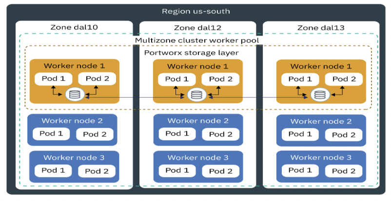

ROKS on VPC Multi-Zone Resiliency Pattern

Carol Hernandez & Shahid Ali

IBM Corporation

May 1, 2024

# Table of Contents

[Executive Summary [3](#executive-summary)](#executive-summary)

[1. Pattern Objectives [3](#pattern-objectives)](#pattern-objectives)

[2. Pattern Overview [3](#pattern-overview)](#pattern-overview)

[3. Pattern Requirements
[5](#pattern-requirements)](#pattern-requirements)

[4. Solution Architecture
[6](#solution-architecture)](#solution-architecture)

[4.1 Solution Architecture Diagram
[8](#solution-architecture-diagram)](#solution-architecture-diagram)

[4.2 Solution Components
[8](#solution-components)](#solution-components)

[5. Compute Design Considerations
[10](#compute-design-considerations)](#compute-design-considerations)

[6. Storage Design Considerations
[10](#storage-design-considerations)](#storage-design-considerations)

[7. Networking Design Considerations
[10](#networking-design-considerations)](#networking-design-considerations)

[9. Resiliency Design Considerations
[11](#resiliency-design-considerations)](#resiliency-design-considerations)

[9.1 High Availability Design
[13](#high-availability-design)](#high-availability-design)

[9.2 Backup and Restore Design
[13](#backup-and-restore-design)](#backup-and-restore-design)

[10. Service Management Design Considerations
[15](#service-management-design-considerations)](#service-management-design-considerations)

[10.1 Monitoring Design [15](#monitoring-design)](#monitoring-design)

[10.2 Logging Design [15](#logging-design)](#logging-design)

[10.3 Alerting Design [15](#alerting-design)](#alerting-design)

[12. Architecture Decisions
[16](#architecture-decisions)](#architecture-decisions)

[12.1 Compute Architecture Decisions
[16](#compute-architecture-decisions)](#compute-architecture-decisions)

[12.2 Storage Architecture Decisions
[17](#storage-architecture-decisions)](#storage-architecture-decisions)

[12.3 Networking Architecture Decisions
[18](#networking-architecture-decisions)](#networking-architecture-decisions)

[12.4 Security Architecture Decisions
[20](#security-architecture-decisions)](#security-architecture-decisions)

[12.4 Resiliency Architecture Decisions
[22](#resiliency-architecture-decisions)](#resiliency-architecture-decisions)

[12.5 Service Management Architecture Decisions
[23](#service-management-architecture-decisions)](#service-management-architecture-decisions)

[13. References [23](#references)](#references)

[14. Glossary of Terms/Abbreviations
[24](#glossary-of-termsabbreviations)](#glossary-of-termsabbreviations)

[**No index entries found.**
[24](#no-index-entries-found.)](#no-index-entries-found.)

# Executive Summary

\<Note to author\> \<Leave this section blank – AI
will be used to create\>

# 1. Pattern Objectives

The objective of this pattern is to provide a resilient solution design
for Red Hat OpenShift Kubernetes Service (ROKS) on VPC architecture
deployment on IBM Cloud that meets high availability requirements for
enterprise production workloads that require persistent storage. This
pattern is intended to:

- Accelerate and simplify solution design by providing a standard IBM
  Cloud deployment architecture reference following the [IBM
  Architecture
  Framework](https://cloud.ibm.com/docs/architecture-framework).

- Provide a prescriptive, end-2-end enterprise-class solution design,
  with diagrams, component architecture decisions along with rationale
  for cloud component selection to meet enterprise requirements.

- Ensure requirements can be met from a performance, system availability
  and security perspective.

This document focuses on leveraging cloud platform capabilities to
architect resilient ROKS on VPC. The pattern provides high availability
and backup architecture within a single region for ROKS on VPC.

# 2. Pattern Overview

The Multi-Zone Resiliency Pattern for ROKS deploys a multi-zone solution
on VPC using compute, storage, and network cloud resources as well as
other Cloud Services provisioned across multiple availability zones
within a single region for production applications that require
persistent storage.

The multi-zone ROKS cluster pattern provides 99.99% infrastructure
availability. For high availability of stateful application, close
coordination between application teams, infrastructure teams (including
availability of storage), and database teams is essential to design
highly available stateful applications on multi-zone ROKS cluster.

This pattern uses a multi-zone workload cluster configured with
Portworx-Store to provide persistent storage for databases and other
stateful application components and a Portworx-Backup cluster for
application data backup and recovery.

Deploying ROKS cluster across three availability zones is the
recommended option for a highly available cluster to be used for highly
available stateful applications. IBM Cloud-managed control plane nodes
are automatically distributed across availability zones on IBM Cloud.
The network communication across IBM Cloud availability zones has low
enough latency to satisfy ROKS etcd and Portworx requirements. Portworx
provides a robust data service platform for persistent storage with
replication and high availability features across multiple availability
zones to run stateful containerized applications. This pattern is not to
be used across IBM Cloud regions, which have much higher latency for
region-to-region network communication.

The Multi-Zone Resiliency Pattern for ROKS can be used to support
business continuity policies or regulatory requirements with country
boundaries or geo data residence constraints. It does not support
out-of-region disaster recovery. See the **<u>Cross-Region Resiliency
Pattern</u>** to address disaster recovery policies or business
continuity policies with geo or distance compliance requirements.

Following the [<u>Architecture
Framework</u>](https://cloud.ibm.com/docs/architecture-framework?topic=architecture-framework-intro)\*,
the Multi-Zone **Resiliency** Pattern for ROKS covers design
considerations and architecture decisions for the following aspects and
domains:

- **Compute:** Red Hat OpenShift Cluster on VPC

- **Storage:** Primary Storage, Backup Storage

- **Networking:** Load Balancing, DNS

- **Security:** Data Security,

- **Resiliency:** High Availability, Backup and Restore

- **Service Management:** Monitoring, Logging, Auditing, Alerting

<table>
<colgroup>
<col style="width: 14%" />
<col style="width: 11%" />
<col style="width: 12%" />
<col style="width: 12%" />
<col style="width: 13%" />
<col style="width: 11%" />
<col style="width: 11%" />
<col style="width: 12%" />
</colgroup>
<thead>
<tr class="header">
<th>Aspects</th>
<th colspan="7">Domains</th>
</tr>
</thead>
<tbody>
<tr class="odd">
<td>Compute</td>
<td>
Bare Metal

Servers
</td>
<td>Virtual Servers</td>
<td>Virtualization</td>
<td>Containers</td>
<td>Serverless</td>
<td></td>
<td></td>
</tr>
<tr class="even">
<td>Storage</td>
<td>Primary Storage</td>
<td>Backup</td>
<td>Archive</td>
<td>
Data

Migration
</td>
<td>SDS</td>
<td></td>
<td></td>
</tr>
<tr class="odd">
<td>Networking</td>
<td>Enterprise Connectivity</td>
<td>BYOIP/Edge Gateways</td>
<td>Segmentation and Isolation</td>
<td>Cloud Native Connectivity</td>
<td>Load Balancing</td>
<td>CDN</td>
<td>DNS</td>
</tr>
<tr class="even">
<td>Security</td>
<td>Data Security</td>
<td>Identity &amp; Access Management</td>
<td>Application Security</td>
<td>Infrastructure and Endpoint</td>
<td>Threat Detection &amp; Response</td>
<td>Governance, Risk &amp; Compliance</td>
<td></td>
</tr>
<tr class="odd">
<td>Resiliency</td>
<td>
High

Availability
</td>
<td>Disaster Recovery</td>
<td>Backup and Restore</td>
<td></td>
<td></td>
<td></td>
<td></td>
</tr>
<tr class="even">
<td>Service Management</td>
<td>Monitoring</td>
<td>Logging</td>
<td>Auditing</td>
<td>Alerting</td>
<td>Event Management</td>
<td>Automated Deployment</td>
<td>Management/ Orchestration</td>
</tr>
<tr class="odd">
<td>Data</td>
<td>Application Integration</td>
<td>Data Ops</td>
<td>Data Analytics</td>
<td>Data Storage</td>
<td>
Business

Intelligence
</td>
<td>
Artificial

Intelligence
</td>
<td></td>
</tr>
</tbody>
</table>

Domains covered in this document

\[Multi-Zone Resiliency for ROKS Solution Design Scope\]

\*The Architecture Framework provides a consistent approach to design
cloud solutions by addressing requirements across a set of "aspects" and
"domains", which are technology-agnostic architectural areas that need
to be considered for any enterprise solution. See [Introduction to the
Architecture
Framework](https://cloud.ibm.com/docs/architecture-framework?topic=architecture-framework-intro)
for more details.

# 3. Pattern Requirements

The following represents a typical set of requirements for
enterprise-ready ROKS deployed in a public cloud.

| **Aspect**         | **Requirements**                                                                                                                                             |
|--------------------|--------------------------------------------------------------------------------------------------------------------------------------------------------------|
| Compute            | Provide platform for containerized applications and management tools with adequate compute capacity                                                          |
| Storage            | Provide storage that meets the stateful applications and database requirements.                                                                              |
| Networking         | Deploy workloads in isolated environment and enforce information flow policies.                                                                              |
|                    | Provide secure, encrypted connectivity to the cloud’s private network for management purposes.                                                               |
|                    | Distribute incoming application requests across available compute resources.                                                                                 |
|                    | Provide public and private DNS resolution to support use of hostnames instead of IP addresses.                                                               |
| Security           | Ensure all operation actions are executed securely.                                                                                                          |
|                    | Protect the boundaries of the application against denial-of-service and application-layer attacks.                                                           |
|                    | Ensure data encryption at rest and in transit for the storage layer.                                                                                         |
|                    | Encrypt all backup data to protect from unauthorized disclosure.                                                                                             |
|                    | Encrypt all security data (operational and audit logs) to protect from unauthorized disclosure.                                                              |
|                    | Encrypt all data using customer managed keys to meet regulatory compliance requirements for additional security and customer control.                        |
|                    | Protect secrets through their entire lifecycle and secure them using access control measures.                                                                |
| Resiliency         | Provide containerized platform that supports application availability targets and business continuity policies.                                              |
|                    | Provide highly available compute, storage, network, and other cloud services for a resilient containerized application with persistent storage requirements. |
|                    | Provide backup solution for containers platform and application data to enable recovery in the event of unplanned outages.                                   |
|                    | Provide highly available storage for containerized databases and stateful applications.                                                                      |
| Service Management | Monitor system health metrics and logs to detect issues that might impact the availability of the platform.                                                  |
|                    | Generate alerts/notifications about issues that might impact the availability of platform to trigger appropriate responses to minimize down time.            |
|                    | Monitor audit logs to track changes and detect potential security problems.                                                                                  |
|                    | Provide a mechanism to identify and send notifications about issues found in audit logs.                                                                     |

# 4. Solution Architecture

- ROKS is deployed on VPC Servers across three availability zones within
  a region.

- Compatible/recommended nodes (that are currently available for ROKS on
  IBM Cloud – Virtual Servers Instances Shared) are used for worker
  nodes to run stateful application in production environment.  
  Ref:
  IBM Cloud Docs

- High performance Secondary storage (10 IOPS Block) is used and
  attached to worker nodes. Portworx Enterprise (an SDS – Software
  Defined Storage) is setup in the cluster across three zones using a
  Converged architecture (compute and storage in same node). Built-in
  internal key-value database (KVDB) is used for Portworx cluster.

- Ref: Portworx
  Docs

- Any databases that may be required for the stateful applications use
  the Portworx SDS.

- In the ROKS multizone cluster, the worker nodes in the worker pools
  are distributed across multiple zones within one region. ROKS
  multizone clusters are designed to *evenly* schedule pods across
  worker nodes and zones to ensure availability and recovery from
  failure. If worker nodes are not spread *evenly* across the zones or
  capacity is insufficient in one of the zones, the ROKS controller
  might fail to schedule all requested pods.

- Application Load Balancer for VPC (ALB) with multi-zone support is
  used to route traffic to the containerized application.

- Containarized stateful applications are deployed within the Workload
  cluster and Virtual Private Cloud (VPC). Management tools, such as
  backup tools, are deployed in the Management cluster and VPC. A local
  Transit Gateway allows traffic between the management and workload
  VPCs.

- Worker nodes in worker pools are placed in separate subnets within
  each availability zone.

- Security groups and ACLs are used as firewalls to limit access to
  worker node server for operational purposes and control network
  traffic.

- All data is encrypted using customer-provided keys managed by Key
  Protect. All storage is encrypted at rest using storage encryption
  with customer-provided keys managed by Key Protect. Data is encrypted
  in transit using TLS encryption.

- Portworx Backup is used to enable backup and recovery of containerized
  applications deployed in the workload cluster. The Portworx Backup
  source is the PX-Store (SDS) configured for the workload cluster. The
  Portwork Backup target is IBM Cloud Object Storage (COS). Portworx
  Backup supports encryption of backups in transit. IBM COS supports
  encryption with Key Management Services. Portworx Backup is setup in
  management VPC in a management or administration cluster also spread
  across three availability zones.

- The OpenShift Container Platform monitoring stack is based on
  the Prometheus. Portworx cluster can be monitored using Prometheus.

- Built-in Red Hat OpenShift logging tools are used for Portworx
  logging.

## 4.1 Solution Architecture Diagram

\[Multi-Zone Resiliency for ROKS Solution Architecture\]

## 4.2 Solution Components

<table>
<colgroup>
<col style="width: 17%" />
<col style="width: 32%" />
<col style="width: 49%" />
</colgroup>
<thead>
<tr class="header">
<th>Category</th>
<th>Solution Components</th>
<th>How it is used in solution</th>
</tr>
</thead>
<tbody>
<tr class="odd">
<td>Compute</td>
<td>Red Hat OpenShift Cluster</td>
<td>Kubernetes cluster for containerized applications and backup
tools</td>
</tr>
<tr class="even">
<td rowspan="4">Storage</td>
<td>VPC Block Storage</td>
<td>For Worker nodes storage &amp; Portworx SDS</td>
</tr>
<tr class="odd">
<td>Portworx Enterprise</td>
<td>Portworx Enterprise provides highly available unified storage across
multiple zone for stateful applications</td>
</tr>
<tr class="even">
<td><u><a
href="https://cloud.ibm.com/docs/cloud-object-storage?topic=cloud-object-storage-about-cloud-object-storage">Cloud
Object Storage</a> (COS)</u></td>
<td>backups, logs (application, operational and audit logs)</td>
</tr>
<tr class="odd">
<td>Portworx Internal KVDB</td>
<td>To store the cluster's state, configuration data, and metadata
associated with storage volumes and snapshots.</td>
</tr>
<tr class="even">
<td rowspan="8">Networking</td>
<td><a
href="https://cloud.ibm.com/docs/iaas-vpn?topic=iaas-vpn-getting-started">VPC
Virtual Private Network (VPN) Client</a></td>
<td>Remote access to manage resources in private network</td>
</tr>
<tr class="odd">
<td><a
href="https://cloud.ibm.com/docs/vpc?topic=vpc-getting-started"><u>Virtual
Private Clouds (VPCs), Subnets, Security Groups (SGs), ACLs</u></a></td>
<td>
VPCs for workload isolation

Subnets, SGs, and ACLs for restricted access to stateful application
components
</td>
</tr>
<tr class="even">
<td><a
href="https://cloud.ibm.com/docs/transit-gateway?topic=transit-gateway-getting-started"><u>Local
Transit Gateway (TGW)</u></a></td>
<td>Connectivity between Workload and Management VPCs</td>
</tr>
<tr class="odd">
<td><a
href="https://cloud.ibm.com/docs/vpc?topic=vpc-about-vpe"><u>Virtual
Private Gateway &amp; Virtual Private Endpoint (VPE)</u></a></td>
<td>Private network access to Cloud Services, e.g. Key Protect, COS,
etc.</td>
</tr>
<tr class="even">
<td><a
href="https://cloud.ibm.com/docs/vpc?topic=vpc-load-balancers">VPC
Application Load Balancer</a></td>
<td>Application Load Balancing for containerized apps</td>
</tr>
<tr class="odd">
<td></td>
<td></td>
</tr>
<tr class="even">
<td><a
href="https://cloud.ibm.com/docs/cis?topic=cis-getting-started">Cloud
Internet Services (CIS)</a></td>
<td>Public DNS resolution</td>
</tr>
<tr class="odd">
<td><a
href="https://cloud.ibm.com/docs/dns-svcs?topic=dns-svcs-about-dns-services"><u>DNS
Services</u></a></td>
<td>Private DNS resolution</td>
</tr>
<tr class="even">
<td rowspan="5">Security</td>
<td><a
href="https://cloud.ibm.com/docs/account?topic=account-cloudaccess"><u>IAM</u></a></td>
<td>IBM Cloud Identity &amp; Access Management</td>
</tr>
<tr class="odd">
<td><a
href="https://cloud.ibm.com/docs/cis?topic=cis-getting-started">Cloud
Internet Services (CIS)</a></td>
<td>DDoS protection and Web App Firewall</td>
</tr>
<tr class="even">
<td><a
href="https://cloud.ibm.com/docs/key-protect?topic=key-protect-about">Key
Protect</a></td>
<td>Key Management Service</td>
</tr>
<tr class="odd">
<td><a
href="https://cloud.ibm.com/catalog/services/secrets-manager"><u>Secrets
Manager</u></a></td>
<td>Certificate and Secrets Management</td>
</tr>
<tr class="even">
<td></td>
<td></td>
</tr>
<tr class="odd">
<td>Service Management</td>
<td>OpenShift Logging &amp; Monitoring Tools</td>
<td>For ROKS cluster and app logs and cluster metrics and app monitoring
&amp; Portworx Enterprise and Portworx Backup logging and
monitoring</td>
</tr>
<tr class="even">
<td rowspan="4">Resiliency &amp; Capacity</td>
<td><a
href="https://cloud.ibm.com/docs/cloud-object-storage/basics?topic=cloud-object-storage-endpoints#endpoints-geo">Cross-Region
COS Buckets</a></td>
<td>Backup storage (target for PX-Backup)</td>
</tr>
<tr class="odd">
<td>Cluster Autoscaler</td>
<td>To adjust compute and storage capacity based on load changes</td>
</tr>
<tr class="even">
<td>VPC VSI (worker nodes) evenly spread across three zones, Portworx
Enterprise (SDS) across multiple zones in a region</td>
<td>For Stateful Containerized apps high availability deployment</td>
</tr>
<tr class="odd">
<td>Portworx Backup (PX-Backup)</td>
<td>For Backup and Restore of stateful applications data</td>
</tr>
</tbody>
</table>

# 5. Compute Design Considerations

The Multi-zone Resiliency pattern for ROKS includes compute options that
are highly available, properly isolated, provide adequate capacity for
the applications, and can handle increased workload demands.

Provision VPC VSI for the worker nodes as follows:

- VPC VSI: select compute and memory profiles, based on capacity and
  performance requirements. Spread worker nodes hosts evenly across
  three availability zones (less than 10 ms latency required for
  synchronous replication). 8 cores, 8 GB memory is to be reserved for
  Portworx, and 10 Gbps bandwidth is recommended.

- Cluster-Autoscaler: With the cluster-autoscaler add-on, the worker
  pools in ROKS on IBM Cloud VPC cluster can be scaled automatically to
  increase or decrease the number of worker nodes in the worker pool
  based on the sizing needs of the scheduled workloads.

- Multi-zone deployment: deploy worker nodes across multiple
  availability zones to protect the application from zone outages. Use a
  VPC Application Load Balancer (ALB) to front end the services.

# 6. Storage Design Considerations

The Multi-zone Resiliency pattern for ROKS includes highly available
storage options on IBM Cloud for the stateful containerized
applications.

The following are the IBM Cloud storage recommendations for ROKS for
production stateful applications:

- Use VPC Block storage (10 IOPS) for worker nodes. Create the Block
  Storage for VPC instances and attach these to each worker node to be
  added to the Portworx storage layer. For highly availability, Portworx
  requires at least 3 worker nodes with raw and unformatted block
  storage (spread the nodes evenly across the AZs).

- Use Cloud Object Storage to store logs and backups. Cloud Object
  Storage (COS) is highly available, durable, and secure and provides
  region and cross-region [resiliency
  options](https://cloud.ibm.com/docs/cloud-object-storage/basics?topic=cloud-object-storage-endpoints).
  Use region COS buckets for logs and cross-region COS buckets for
  backups.

- Portworx: Portworx provides a software defined storage (SDS) solution
  for a multizone ROKS cluster for stateful apps. Portworx components to
  be used: PX-Store, STORK and PX-Backup

# 7. Networking Design Considerations

The Multi-zone Resiliency pattern for ROKS leverages IBM Cloud VPC
infrastructure and network services to segment the management and
application workloads and support the application deployment across
multiple availability zones.

- Deploy the ROKS within a Virtual Private Cloud (VPC) provisioned
  across multiple availability zones within a region to provide workload
  isolation within the public cloud.

- Place each worker node in a separate subnet in each availability zone
  (less than 10 ms latency required for synchronous replication). Use
  security groups and ACLs as firewalls to limit access to server
  instances for operational purposes and to control network traffic.

- Use VPC Application Load Balancers (ALB) to distribute incoming
  requests to stateful containerized applications. Configure load
  balancing policies, rules, and check health settings to distribute the
  requests across the available services.

- Use a Public Application Load Balancer in the front end. Use a Private
  Application Load Balancer in the backend.

- Configure the Application Load Balancers for high availability by
  selecting the subnets in each availability zone where the worker nodes
  are deployed. The ALB automatically provisions load balancing
  appliances for each subnet zone.

- Configure the Cloud Internet Service (CIS) as a proxy to the public
  VPC Load Balancers to leverage CIS capabilities such as Web
  Application Firewall (WAF) and DDoS protection to secure the Web
  Application.

- Use IBM Cloud Secrets Manager service to manage the Transport Layer
  Security (TLS) certificate for all incoming HTTPS requests. Make the
  SSL certificates available to the VPC Application Load Balancers to
  configure HTTPS encryption.

- Use CIS to provision and configure DNS records for public DNS
  resolution. Use IBM Cloud DNS to manage DNS records and resolve domain
  names from IBM Cloud's private network.

# 9. Resiliency Design Considerations

The resiliency of applications deployed on Red Hat OpenShift clusters is
determined by the availability of the cluster as well as the
availability of the application.

**Cluster availability**

The availability of Red Hat OpenShift clusters depends on the
availability of the control plane components, namely, the master nodes
and etcd database, and the availability of the worker nodes where the
applications are deployed.

For workloads deployed on Red Hat OpenShift on IBM Cloud clusters, IBM
Cloud is responsible for the availability of the cluster’s control
plane. When a Red Hat OpenShift on IBM Cloud cluster is created, IBM
Cloud sets up highly available master nodes and control plane
components, automatically backs up etcd data, and provides automated
disaster recovery for the control plane. IBM Cloud users are responsible
for setting up highly available worker nodes. The following are
deployment options for Red Hat OpenShift on IBM Cloud clusters:

> **Single-zone clusters**
>
> In single zone clusters, all the worker nodes are provisioned in one
> availability zone selected by the user. For high availability, at
> least 3 worker nodes are recommended so that application instances can
> be distributed across multiple worker nodes to provide protection from
> worker node failures. Red Hat OpenShift automatically reschedules pods
> from unavailable worker nodes. In single-zone clusters, IBM Cloud
> automatically creates three replicas of master components for high
> availability. If the cluster is created in a multizone region, the
> three master replicas are spread across the availability zones in the
> region.
>
> Single-zone clusters provide protection from logical and container
> failures but do not protect from zone failures or physical host
> failures since there is no guarantee that the worker nodes will be
> placed in different physical hosts. Single-zone clusters provide
> cost-effective solutions with 99.9% infrastructure availability that
> might be appropriate for non-production environments or non-business
> critical applications.
>
> **Multi-zone clusters**
>
> In multi-zone clusters, the worker nodes are distributed across
> availability zones selected by the user. IBM Cloud automatically
> provisions three replicas of master components spread across
> availability zones within a region for high availability.
>
> It is recommended to spread the worker nodes evenly across three
> zones, with 50% capacity provisioned in each zone for a total 150%
> capacity across all worker nodes. This is a cost-efficient solution
> that guarantees 100% capacity for the workloads in the event of one
> zone failure and provides 99.99% infrastructure availability. In
> contrast, spreading the nodes across two zones would require 100%
> capacity in each zone for a total capacity of 200% vs 150% and would
> offer only 99.9% infrastructure availability.
>
> Multi-zone clusters, also known as stretched clusters, provide
> protection from zone failures and physical host failures. If resources
> in one zone go down, the workloads can continue to run in worker nodes
> in the other zones.
>
> Multi-zone clusters are recommended for business-critical
> applications.

**Application availability**

The availability of a containerized application depends on the
availability of the pods where the application is deployed and the
application’s scalability and ability to handle workload changes. For
stateful applications, persistent storage data availability and
consistency are also important considerations.

You can use Kubernetes constructs such as deployments, replica sets, and
pod anti-affinity to increase the application availability, as follows:

- Use a
  [deployment](https://kubernetes.io/docs/concepts/workloads/controllers/deployment/)
  to support pod rescheduling, replica sets, and rolling updates.

- Use  [<u>replica
  sets</u>](https://cloud.ibm.com/docs/openshift?topic=openshift-app#replicaset) to
  define multiple instances of your application. Include enough replicas
  for your workload plus two. 

- Use  [<u>pod
  anti-affinity</u>](https://cloud.ibm.com/docs/openshift?topic=openshift-app#affinity) 
  options to spread the deployment of pods across different worker nodes
  to protect applications from worker nodes failures. Note that worker
  nodes in one zone are not guaranteed to be on separate physical
  compute hosts. To protect against physical compute hosts failure, you
  must set up a multi-zone cluster which will spread worker nodes across
  physical hosts in different zones.

Enable [<u>horizontal pod
autoscaling</u>](https://cloud.ibm.com/docs/openshift?topic=openshift-update_app#app_scaling) to
automatically increase or decrease the number of instances of the
application based on metrics collected from the pods.

Use [<u>cluster
autoscaler</u>](https://cloud.ibm.com/docs/openshift?topic=openshift-cluster-scaling-classic-vpc&interface=ui)
to automatically increase or decrease the number of worker nodes based
on workload demands.

For stateful applications, use highly available persistent storage based
on the application requirements and deploy applications in a multizone
cluster to distribute persistent storage data across multiple
availability zones.

For applications deployed in multi-zone clusters, data replication
across availability zones can be achieved through application-level
replication or storage replication.

Portworx and OpenShift Data Foundation (ODF) are Software Defined
Storage (SDS) solutions that support data replication and can be
deployed on Red Hat OpenShift clusters on IBM Cloud to provide
persistent storage for stateful apps. Portworx and ODF replicate data
across worker nodes to ensure the stateful app can be rescheduled to a
different worker node in case of failure without losing data.

## 9.1 High Availability Design

The Multi-zone Resiliency pattern for ROKS deploys the Red Hat OpenShift
cluster architecture across multiple availability zones within a region.
The worker nodes are evenly spread across three availability zones. For
multizone clusters, Portworx is recommended as SDS for stateful
applications. Portworx is a highly available SDS solution that provides
persistent storage for the containerized databases and stateful apps and
enables sharing of data between pods across multiple zones. Portworx
abstracts storage of various types and sizes attached to the worker
nodes in the cluster. Worker nodes with attached storage are added as a
node to a storage cluster and presented as a virtual storage pool for
the stateful applications. The storage cluster is managed by PX-Store
component of Portworx. Portworx automatically replicates data in the
volumes across worker nodes and zones in the cluster so stateful app can
be rescheduled to another worker node in case of a worker node failure
or reboot providing high availability across nodes/racks/AZs. PX-Store
supports multi-writer shared volumes across multiple containers.

Following are Portworx (HA) requirements for production stateful
applications:

- Minimum 3 worker nodes across 3 AZs

- Minimum of 8 cores & 8 GB RAM are recommended to be reserved for
  Portworx  
  \[Note: These are minimum number of nodes/cores/memory. Depending on
  the scale of production environment, more nodes and higher
  cores/memory will be required.\]

## 9.2 Backup and Restore Design

Backup and restore solutions for containerized applications must protect
both the cluster as well as the application to enable recovery in the
event of failures triggered by ransomware attacks, software data
corruption, accidental deletions, or any other cause.

Red Hat OpenShift on IBM Cloud clusters include automatic back-up and
recovery of cluster control plane components, namely etcd data. The user
is responsible for backing up the application. Application backups must
protect application data and metadata included in application-related
cluster resources, stateful application’s data stored in persistent
storage, and internal images.

The Multi-zone Resiliency pattern for ROKS uses Portworx to backup the
application.

Portworx Backup provides Kubernetes data protection platform for the
persistent data both in transit and at rest. It is app-aware including
stateful apps and provides a simple self-service interface for backup
and restore. It can operate at Pod, Namespace or Cluster level. Portworx
Backup (PX-Backup) is setup in Management VPC in an administration
mutizone cluster. The following is Portworx Backup solution at a high
level:

- Backup Source: Portworx Enterprise (PX-Store) – SDS for stateful
  application

- Target: IBM Cloud Object Storage (COS)

- Portworx has Backup Automation and Scheduling

- STORK (STorage Orchestrator Runtime for Kubernetes) provides
  Kubernetes consistent backup of applications (running in workload
  cluster) across multi-pod in a namespace. STORK is an agent and should
  be installed on the application cluster before PX-Backup cluster
  installation. STORK bridges the gap between Portworx Backup running on
  your administration cluster, and the application cluster that need to
  be backed up.

- Portworx Backup uses MongoDB (runs with 3 replicas for high
  availability) as the datastore (installed as part of the Portworx
  Backup deployment) for writing the metadata of backup object data. At
  this time, PX-Backup does not support an externally managed database
  as the datastore.

>  alt="Portworx Backup Architecture" />

# 10. Service Management Design Considerations

To ensure Portworx storage infrastructure's health, performance, and
reliability, the Portworx cluster needs to be monitored. For monitoring
Portworx, ROKS on IBM Cloud include built-in tools (Prometheus) to
manage the health of single cluster instance. For Portworx on Red Hat
OpenShift version 4.14 or above, Portworx components need to be
configured to work with the OpenShift Prometheus.

For Portworx logging, ROKS on IBM Cloud include built-in tools to manage
the health of single cluster instance. Built-in pod logs are not
configured with persistent storage and integration with a cloud database
is required to back up the logging data and make it highly available.

Note: Portworx upgrades should follow the instructions at
https://docs.portworx.com/portworx-enterprise/operations/operate-kubernetes/upgrade/upgrade-px-ibm.

## 10.1 Monitoring Design

The OpenShift Container Platform monitoring stack is based on
the Prometheus. Portworx cluster can be monitored using Prometheus. For
Portworx on Red Hat OpenShift version 4.14 or above, Portworx components
need to be configured to work with the OpenShift Prometheus deployment
for monitoring, since the native Portworx Prometheus support is not
available on these OpenShift versions. To configure the Portworx
monitoring solution see
<https://docs.portworx.com/portworx-enterprise/install-portworx/monitoring/monitor-portworx-cluster>.
\[Note: PX Monitoring data can also be shown in IBM Cloud Monitoring and
PX Grafana dashboard.\]

## 10.2 Logging Design

Built-in Red Hat OpenShift logging tools are used and can be installed
using the cluster logging operator. The worker pool should have at least
4 cores and 32 GB memory and 3 worker nodes to run cluster logging
stack. To deploy the cluster logging operator and stack on ROKS on IBM
Cloud cluster see
<https://cloud.ibm.com/docs/openshift?topic=openshift-health#oc_logging_operator>.
The cluster logging instance needs an IBM Cloud Block Storage storage
class.

## 10.3 Alerting Design

Prometheus Alertmanager handles alerts sent from the Prometheus server
based on the set rules. When a rule is triggered, Alertmanager sends a
corresponding notification to the specified receivers. The receivers are
configured using an Alertmanager config file. To configure the Portworx
alerting solution see
<https://docs.portworx.com/portworx-enterprise/install-portworx/monitoring/monitor-portworx-cluster>.

# 12. Architecture Decisions

## 12.1 Compute Architecture Decisions

<table>
<colgroup>
<col style="width: 4%" />
<col style="width: 0%" />
<col style="width: 17%" />
<col style="width: 17%" />
<col style="width: 18%" />
<col style="width: 17%" />
<col style="width: 24%" />
</colgroup>
<thead>
<tr class="header">
<th><strong>#</strong></th>
<th colspan="2"><strong>AD</strong></th>
<th><strong>Requirement</strong></th>
<th><strong>Alternative</strong></th>
<th><strong>Decision</strong></th>
<th><strong>Rationale</strong></th>
</tr>
</thead>
<tbody>
<tr class="odd">
<td colspan="7"><strong>Compute: VPC Servers</strong></td>
</tr>
<tr class="even">
<td colspan="2">1</td>
<td>
Compute (portworx requirements)

Worker nodes
</td>
<td rowspan="3">- Provide properly isolated compute resources with
adequate compute capacity and storage for the production stateful
applications</td>
<td>
- VPC VSIs

- VPC Dedicated Hosts

- VPC Bare Metal

- VPC Bare Metal SDS Compliant
</td>
<td>VPC VSIs</td>
<td>Currently available option for ROKS.</td>
</tr>
<tr class="odd">
<td colspan="2">2</td>
<td>Host Profile for Worker nodes</td>
<td>
- Data Intensive

- RAM Intensive (multiple)
</td>
<td>Based on memory, cores and storage requirements</td>
<td>Select the VSI as per application requirements. Minimum of 8 cores,
8 GB memory is to be reserved for Portworx.</td>
</tr>
<tr class="even">
<td colspan="2">3</td>
<td>Worker Nodes distribution across AZs</td>
<td><ul>
<li>
Evenly across three AZs
</li>
<li>
Other
</li>
</ul></td>
<td>Evenly across 3 AZs</td>
<td>If worker nodes are not spread evenly across the zones or capacity
is insufficient in one of the zones, the ROKS controller might fail to
schedule all requested pods.</td>
</tr>
<tr class="odd">
<td colspan="2">5</td>
<td>Worker Nodes Spread across multiple zones</td>
<td>- Provide compute resources that are highly available and can handle
increased workload demands</td>
<td><ul>
<li>
Anti-affinity pod deployment
</li>
<li>
No control
</li>
</ul></td>
<td>Anti-affinity pod deployment</td>
<td>Protection against zone failure</td>
</tr>
<tr class="even">
<td colspan="2">6</td>
<td>Portwork Backup (PX-Backup) Cluster worker nodes (three nodes spread
across 3 AZs)</td>
<td>- Provide compute resources that are highly available for
PX-Backup</td>
<td><ul>
<li>
8 cores, 16 GB (VSI)
</li>
<li>
Other options
</li>
</ul></td>
<td>8 cores, 16 GB (VSI)</td>
<td>As per Portworx Backup documentation</td>
</tr>
</tbody>
</table>

## 12.2 Storage Architecture Decisions

<table>
<colgroup>
<col style="width: 4%" />
<col style="width: 0%" />
<col style="width: 17%" />
<col style="width: 17%" />
<col style="width: 18%" />
<col style="width: 17%" />
<col style="width: 24%" />
</colgroup>
<thead>
<tr class="header">
<th><strong>#</strong></th>
<th colspan="2"><strong>AD</strong></th>
<th><strong>Requirement</strong></th>
<th><strong>Alternative</strong></th>
<th><strong>Decision</strong></th>
<th><strong>Rationale</strong></th>
</tr>
</thead>
<tbody>
<tr class="odd">
<td colspan="7"><strong>Storage</strong></td>
</tr>
<tr class="even">
<td colspan="2">1</td>
<td>
Main Storage for

Worker nodes
</td>
<td>- Provide highly available storage that meets the application
performance requirements.</td>
<td>
- VPC Block storage (5 IOPS)

- VPC Block storage (10 IOPS) 
- VPC File storage 
- Cloud Object storage
</td>
<td>- VPC Block storage (10 IOPS) (performance for production
environment)</td>
<td>For Portworx across multi zone. Also, Cloud drives allows to
dynamically provision the Portworx volumes. Portworx requires raw and
unformatted block storage.</td>
</tr>
<tr class="odd">
<td colspan="2">2</td>
<td>SDS</td>
<td>
- Provide highly available storage that

abstracts data storage for worker nodes and aggregates them into a
virtual pool.
</td>
<td>
- Portworx 
- ODF

- GlusterFS
</td>
<td>Portworx</td>
<td>For persistent storage across multi zone for stateful containerized
apps. Portworx provides multiple data access mode like Read Write Many.
Portworx provides persistent volume with high availability and disaster
recovery as well data protection for backup and recovery.</td>
</tr>
<tr class="even">
<td colspan="2">3</td>
<td>Portworx Architecture</td>
<td>Provide highly available SDS for generic stateful application</td>
<td>
Converged

Disaggregated
</td>
<td>Converged – each worker node has the role of both computer and
storage</td>
<td>Each worker node is connected to VPC Block Storage which provides
reasonable performance for most workloads. [Note: Depending on the type
of workloads, the disaggregated architecture may be suitable.]</td>
</tr>
<tr class="odd">
<td colspan="2">4</td>
<td>
Logs Storage

(Audit, Operational)
</td>
<td>- Provide highly available storage for logs</td>
<td>- VPC Block storage 
- Cloud Object storage (COS)</td>
<td>VPC Block storage</td>
<td>Built-in Red Hat OpenShift monitoring tools are used and can be
installed using the cluster logging operator. The cluster logging
instance needs an IBM Cloud Block Storage class.</td>
</tr>
<tr class="even">
<td colspan="2">5</td>
<td>Backup Storage</td>
<td>- Provide highly available storage for backups</td>
<td>- VPC Block storage 
- Cloud Object storage</td>
<td>COS</td>
<td>Cloud Object Storage provides low cost, high available storage for
data backups. Cloud Object Storage can be cross-region for data backups
to enable recovery in the event of a region outage.</td>
</tr>
<tr class="odd">
<td colspan="2">6</td>
<td>Portworx key-value database (KVDB)</td>
<td>Provide a KVDB solution for Portworx to store the cluster's state,
configuration data, and metadata associated with storage volumes and
snapshots.</td>
<td>
-Internal KVDB for Portworx

- IBM Cloud Database for etcd

- Other external KVDB
</td>
<td>Internal KVDB for Portworx</td>
<td>Portworx recommends using the built-in internal KVDB for your
Portworx cluster except when configuring a synchronous DR setup, for
example. For setting up external KVDB, see <a
href="https://cloud.ibm.com/docs/containers?topic=containers-storage_portworx_kv_store#portworx-kv-db">https://cloud.ibm.com/docs/containers?topic=containers-storage_portworx_kv_store#portworx-kv-db</a>.</td>
</tr>
</tbody>
</table>

## 12.3 Networking Architecture Decisions

## 

<table>
<colgroup>
<col style="width: 4%" />
<col style="width: 0%" />
<col style="width: 13%" />
<col style="width: 17%" />
<col style="width: 18%" />
<col style="width: 19%" />
<col style="width: 24%" />
</colgroup>
<thead>
<tr class="header">
<th><strong>#</strong></th>
<th colspan="2"><strong>AD</strong></th>
<th><strong>Requirement</strong></th>
<th><strong>Alternative</strong></th>
<th><strong>Decision</strong></th>
<th><strong>Rationale</strong></th>
</tr>
</thead>
<tbody>
<tr class="odd">
<td colspan="7"><strong>1. Enterprise Connectivity</strong></td>
</tr>
<tr class="even">
<td colspan="2">1.1</td>
<td>Connectivity for management</td>
<td>- Provide secure, encrypted connectivity to the cloud’s private
network for management purposes.</td>
<td>
- Client VPN for VPC

- VPN for VPC
</td>
<td>Client VPN for VPC</td>
<td>Client VPN for VPC provides client-to-site connectivity, which
allows remote devices to securely connect to the VPC network using an
OpenVPN software client.</td>
</tr>
<tr class="odd">
<td colspan="7"><strong>2. Network Segmentation and
Isolation</strong></td>
</tr>
<tr class="even">
<td colspan="2">2.1</td>
<td>App Deployment</td>
<td>
- Deploy workloads in isolated environment and enforce
information flow policies.

- Provide isolated security zones between app tiers
</td>
<td>
- Virtual Private Clouds (VPCs)

- Subnets

- Security Groups (SGs)

- ACLs
</td>
<td>VPCs, subnets, Security Groups (SGs) and ACLs</td>
<td>
VPCs provide secure, virtual networks for apps which are
logically isolated from other public cloud tenants.

Subnets provide a range of private IP addresses for each app within a
zone.

Security Groups and ACLs are used as firewalls to limit access to
servers and apps.
</td>
</tr>
<tr class="odd">
<td colspan="7"><strong>3. Cloud Native Connectivity</strong></td>
</tr>
<tr class="even">
<td colspan="2">3.1</td>
<td>Connectivity to Cloud Services</td>
<td>- Provide secure connection to Cloud Services</td>
<td>
- Virtual Private Endpoints (VPE)

- Private Cloud Service endpoints

- Public Cloud Service Endpoints
</td>
<td>Virtual Private Endpoints (VPE)</td>
<td>Virtual Private Endpoints enable connectivity to IBM Cloud services
using private IP addresses allocated from a VPC subnet.</td>
</tr>
<tr class="odd">
<td colspan="2">3.2</td>
<td>VPC to VPC Connectivity</td>
<td>- Connect two or more VPCs over private network</td>
<td>
- Local Transit Gateway

- Global Transit Gateway
</td>
<td>Local Transit Gateway (TGW)</td>
<td>The Local Transit Gateway enables connectivity between the
Management and Workload VPCs. The Management VPC has Portworx Backup
cluster.</td>
</tr>
<tr class="even">
<td colspan="7"><strong>4. Load Balancing</strong></td>
</tr>
<tr class="odd">
<td colspan="2">4.1</td>
<td>Application Load Balancer</td>
<td>- Route web user http/https requests</td>
<td>
- VPC ALB

- VPC NLB
</td>
<td>VPC ALB</td>
<td>
VPC ALB is recommended for web-based workloads.

- Provides layer 4 and layer 7 load balancing

- Supports HTTP, HTTPS, and TCP requests

- Supports SSL offloading.
</td>
</tr>
<tr class="even">
<td colspan="2">4.2</td>
<td>
Local Load Balancing:

Web Tier
</td>
<td>- Distribute user requests across zones for high availability</td>
<td>
- Public VPC ALB

- Private VPC ALB

- Public VPC NLB

- Private VPC NLB
</td>
<td>Public ALB</td>
<td>The public VPC ALB distributes incoming user requests among
services. The VPC ALB is configured with subnets across multiple zones
for multi-zone availability.</td>
</tr>
<tr class="odd">
<td colspan="2"></td>
<td></td>
<td></td>
<td></td>
<td></td>
<td></td>
</tr>
<tr class="even">
<td colspan="7"><strong>5. Domain Name System (DNS)</strong></td>
</tr>
<tr class="odd">
<td colspan="2">5.1</td>
<td>Public DNS</td>
<td rowspan="2">- Provide DNS resolution to support use of hostnames
instead of IP addresses for applications</td>
<td>
- IBM Cloud Internet Services (CIS)

- IBM Cloud DNS
</td>
<td>IBM Cloud Internet Services (CIS)</td>
<td>IBM Cloud Internet Services supports provisioning and configuring
DNS records for public DNS resolution and can be integrated with the
public VPC ALBs for the web tier.</td>
</tr>
<tr class="even">
<td colspan="2">5.2</td>
<td>Private DNS</td>
<td>- IBM Cloud DNS</td>
<td>IBM Cloud DNS</td>
<td>IBM Cloud DNS manages private DNS records, resolves domain names
from IBM Cloud's private network, and can be integrated with the private
VPC ALBs for the app and DB tiers.</td>
</tr>
</tbody>
</table>

## 12.4 Security Architecture Decisions

<table>
<colgroup>
<col style="width: 4%" />
<col style="width: 0%" />
<col style="width: 12%" />
<col style="width: 17%" />
<col style="width: 19%" />
<col style="width: 19%" />
<col style="width: 24%" />
</colgroup>
<thead>
<tr class="header">
<th><strong>#</strong></th>
<th colspan="2"><strong>AD</strong></th>
<th><strong>Requirement</strong></th>
<th><strong>Alternative</strong></th>
<th><strong>Decision</strong></th>
<th><strong>Rationale</strong></th>
</tr>
</thead>
<tbody>
<tr class="odd">
<td colspan="7"><strong>1. Data: Encryption at Rest</strong></td>
</tr>
<tr class="even">
<td colspan="2">1.1</td>
<td>Encryption Approach</td>
<td>- Encrypt all data to protect from unauthorized disclosure</td>
<td>
- Encryption with provider keys

- Encryption with customer-managed keys
</td>
<td>Encryption with customer-managed keys</td>
<td>Encrypting data with customer-managed keys is recommended since it
provides added security and customer control needed to meet regulatory
compliance requirements.</td>
</tr>
<tr class="odd">
<td colspan="2">1.2</td>
<td>
Data Encryption

(SDS)
</td>
<td>- Encrypt all application data at rest to protect from unauthorized
disclosure</td>
<td>
- Storage encryption with customer-managed keys

- App-level encryption with customer-managed keys
</td>
<td>Storage Encryption with customer-managed keys</td>
<td>Portworx Encryption is integrated with IBM Key Protect or Hyper
Protect Crypto Services API.</td>
</tr>
<tr class="even">
<td colspan="2">1.3</td>
<td>
Data Encryption

Backups
</td>
<td>- Encrypt all backup data to protect from unauthorized
disclosure</td>
<td>
Storage encryption with customer-managed keys

App-level encryption
</td>
<td>Storage encryption with customer-managed keys</td>
<td>Backup data is stored in COS which supports encryption with
customer-managed keys by selecting a KMS.</td>
</tr>
<tr class="odd">
<td colspan="7"><strong>2. Data: Encryption in Transit</strong></td>
</tr>
<tr class="even">
<td colspan="2">2.1</td>
<td>App Data</td>
<td rowspan="2">- Encrypt all application data in transit to protect
from unauthorized disclosure</td>
<td>Application-level encryption with TLS</td>
<td>Application-level encryption with TLS</td>
<td>Web app uses HTTPS protocol to encrypt data transmissions.</td>
</tr>
<tr class="odd">
<td colspan="2">2.2</td>
<td>Backup Data</td>
<td>Application-level encryption with TLS</td>
<td>Application-level encryption with TLS</td>
<td>
Portworx Backup supports encryption of backups in transit.

The PX-Backup uses TLS to encrypt data in transit to COS.
</td>
</tr>
<tr class="even">
<td colspan="7"><strong>3. Data: Key Lifecycle Management &amp;
Certificate Management</strong></td>
</tr>
<tr class="odd">
<td colspan="2">3.1</td>
<td>Key Lifecycle Management &amp; HSM</td>
<td>- Encrypt data at rest and in transit using customer managed keys to
protect from unauthorized access</td>
<td>
Key Protect

Hyper Protect Crypto Services (HPCS)
</td>
<td>Key Protect</td>
<td>Key Protect is recommended for applications that need to comply with
regulations requiring encryption of data with customer-managed keys. Key
Protect provides key management services using a shared (multi-tenant)
FIPS 140-2 Level 3 certified hardware security modules (HSMs).</td>
</tr>
<tr class="even">
<td colspan="2">3.2</td>
<td>Certificate Management</td>
<td>- Protect secrets through their entire lifecycle and secure them
using access control measures</td>
<td>
Secrets Manager

BYO Certificate Manager
</td>
<td>Secrets Manager</td>
<td>IBM Secrets Manager creates, leases, and centrally manages secrets
used by IBM Cloud Services or customer applications. Secrets are stored
in a dedicated instance of Secrets Manager and can be encrypted using a
KMS.</td>
</tr>
<tr class="odd">
<td colspan="7"><strong>4. Application Security</strong></td>
</tr>
<tr class="even">
<td colspan="2">4.1</td>
<td>DDoS</td>
<td>
- Enforce information flow policies and protect the boundaries of
the application.

- Protect against or limit the effects of denial-of-service
attacks.
</td>
<td>- IBM Cloud Internet Services (CIS)</td>
<td>IBM Cloud Internet Services (CIS)</td>
<td rowspan="2">IBM Cloud Internet Services provides Distributed Denial
of Service (DDoS) and Web Application Firewall security features to
protect applications exposed to the public network</td>
</tr>
<tr class="odd">
<td colspan="2">4.2</td>
<td>Web Application Firewall</td>
<td>- Protect web applications from application layer attacks.</td>
<td>
- IBM Cloud Internet Services (CIS)

- BYO Firewall on VPC VSI
</td>
<td>IBM Cloud Internet Services (CIS)</td>
</tr>
</tbody>
</table>

## 12.4 Resiliency Architecture Decisions

<table>
<colgroup>
<col style="width: 4%" />
<col style="width: 0%" />
<col style="width: 13%" />
<col style="width: 17%" />
<col style="width: 18%" />
<col style="width: 19%" />
<col style="width: 24%" />
</colgroup>
<thead>
<tr class="header">
<th><strong>#</strong></th>
<th colspan="2"><strong>AD</strong></th>
<th><strong>Requirement</strong></th>
<th><strong>Alternative</strong></th>
<th><strong>Decision</strong></th>
<th><strong>Rationale</strong></th>
</tr>
</thead>
<tbody>
<tr class="odd">
<td colspan="7"><strong>1. High Availability</strong></td>
</tr>
<tr class="even">
<td colspan="2">1.1</td>
<td>Workload and Portworx cluster High Availability Deployment</td>
<td>
- Ensure availability of resources in the event of outages.

- Support SLA targets for application availability.
</td>
<td>
- Single zone, single region

- Multi zone, single region

- Multi-zone, multi region
</td>
<td>Multi-zone, single region</td>
<td>
<strong>Recommended deployment for Multi-Zone Resiliency
Pattern</strong>

- Provides protection from zone outage

- Supports 99.99% availability for the infrastructure

Recommended approach for:

- Core business applications

- Production level workloads with stringent resiliency
requirements

- Business continuity policies with country boundaries or geo data
residence constraints
</td>
</tr>
<tr class="odd">
<td colspan="2">1.2</td>
<td>Portworx Backup cluster</td>
<td>Ensure availability of backup solution in case of workload cluster
failures</td>
<td>
-Separate cluster for Portworx Backup

-Use workload cluster
</td>
<td>Separate cluster for Portworx Backup</td>
<td>Best Practice is to use a separate cluster for Portworx Backup since
if the backup solution is installed on workload cluster and in the case
the workload cluster goes down so does the backup solution.</td>
</tr>
<tr class="even">
<td colspan="2">1.3</td>
<td>Portworx Backup cluster High Availability Deployment</td>
<td>- Ensure availability of Portworx Backup service in the event of
outages.</td>
<td>
- Single zone, single region

- Multi zone, single region
</td>
<td>Multi-zone, single region</td>
<td>Provides protection from zone outage</td>
</tr>
<tr class="odd">
<td colspan="7"><strong>2. Backup and Restore</strong></td>
</tr>
<tr class="even">
<td colspan="2">2.1</td>
<td>Backup Type</td>
<td>Backup and Restore at the application level</td>
<td>
-Application backup

-VMs backup

-Nodes backup

-Other
</td>
<td>Application backup</td>
<td>Kubernetes consistent backup of applications allows for fast and
efficient recovery of applications in the cluster.</td>
</tr>
<tr class="odd">
<td colspan="2">2.2</td>
<td>Application backup</td>
<td>- Backup applications to enable recovery of applications in the
event of unplanned outages</td>
<td>
- Portworx Backup

- Kasten

- Trilio for OpenShift

- Others (Velero, KubeDR, Zerto for K8s)
</td>
<td>Portworx Backup</td>
<td>Portworx not only support Kubernetes backup and restore, but also DR
and local HA. Provides Kubernetes consistent backup of applications
across multi-pod in a namespace using STORK (STorage Orchestrator
Runtime for Kubernetes).</td>
</tr>
<tr class="even">
<td colspan="2">2.3</td>
<td>Backup Automation</td>
<td>- Schedule regular applications backups based on backup policy
requirements to enable data recovery in the event of unplanned
outages</td>
<td>
- Portworx Backup

- Kasten

- Trilio for OpenShift

- Others (Velero, KubeDR, Zerto for K8s)
</td>
<td>Portworx Backup</td>
<td>Portworx Backup allows defining backup policies to manage the
creation and deletion of backup and provides UI in Portworx Central that
has RBAC capabilities.</td>
</tr>
</tbody>
</table>

## 12.5 Service Management Architecture Decisions

<table>
<colgroup>
<col style="width: 4%" />
<col style="width: 0%" />
<col style="width: 13%" />
<col style="width: 17%" />
<col style="width: 18%" />
<col style="width: 19%" />
<col style="width: 24%" />
</colgroup>
<thead>
<tr class="header">
<th><strong>#</strong></th>
<th colspan="2"><strong>AD</strong></th>
<th><strong>Requirement</strong></th>
<th><strong>Alternative</strong></th>
<th><strong>Decision</strong></th>
<th><strong>Rationale</strong></th>
</tr>
</thead>
<tbody>
<tr class="odd">
<td colspan="7"><strong>1. Monitoring</strong></td>
</tr>
<tr class="even">
<td colspan="2">1.1</td>
<td>Operational Monitoring of ROKS cluster</td>
<td>- Monitor ROKS cluster health</td>
<td>
- OpenShift Monitoring integrated with IBM Cloud Monitoring

- IBM Cloud Monitoring

- BYO Monitoring Tool
</td>
<td>OpenShift Monitoring integrated with IBM Cloud Monitoring</td>
<td>OpenShift monitoring can also be used to monitor Portworx. For an
overall solution, it should be integrated with IBM Cloud
Monitoring.</td>
</tr>
<tr class="odd">
<td colspan="2">1.2</td>
<td>Operational Monitoring of Portworx components</td>
<td>- Monitor Portworx components health</td>
<td>
- OpenShift Monitoring

- IBM Cloud Monitoring

- BYO Monitoring Tool
</td>
<td>OpenShift Monitoring</td>
<td>Portworx monitoring requires OpenShift monitoring (Prometheus)</td>
</tr>
<tr class="even">
<td colspan="7"><strong>2. Logging</strong></td>
</tr>
<tr class="odd">
<td colspan="2">2.1</td>
<td>Logs Monitoring for ROKS</td>
<td>- Monitor operational logs to detect issues that might impact the
availability of ROKS</td>
<td>
- OpenShift Logging integrated with IBM Cloud Logging

- IBM Cloud Logging

- BYO Logging Tool
</td>
<td>OpenShift Logging integrated with IBM Cloud Logging</td>
<td>OpenShift logging can also be used for Portworx. For an overall
solution, it should be integrated with IBM Cloud Logging.</td>
</tr>
<tr class="even">
<td colspan="2">2.2</td>
<td>Logs Monitoring for Portworx components</td>
<td></td>
<td>
- OpenShift Logging

- IBM Cloud Logging

- BYO Logging Tool
</td>
<td>OpenShift Logging</td>
<td>On IBM Cloud, Portworx logging requires OpenShift logging tools</td>
</tr>
<tr class="odd">
<td colspan="7"><strong>3. Alerting</strong></td>
</tr>
<tr class="even">
<td colspan="2">3.1</td>
<td>Operational alerts for ROKS cluster</td>
<td>- Provide a mechanism to identify and send notifications about
operational issues found in ROKS cluster</td>
<td>
- Prometheus Alertmanager

- IBM Cloud Monitoring +

IBM Cloud Logging + Event Notifications
</td>
<td>Prometheus Alertmanager</td>
<td>Prometheus Alertmanager can be used for Portworx components</td>
</tr>
<tr class="odd">
<td colspan="2">3.2</td>
<td>Operational alerts for Portworx components</td>
<td>- Provide a mechanism to identify and send notifications about
issues found in Portworx components</td>
<td>
- Prometheus Alertmanager

- IBM Cloud Activity Tracker +

IBM Monitoring +

Event Notifications
</td>
<td>Prometheus Alertmanager</td>
<td>Portworx alerting solution is based on Prometheus Alertmanager</td>
</tr>
</tbody>
</table>

# 13. References

- **VPC Resiliency on IBM Cloud White Paper**

- Cluster Autoscaler: …

- ALB multi-zone configuration:

<https://cloud.ibm.com/docs/vpc?topic=vpc-load-balancers-about&interface=api#horizontal-scaling>

- IBM Cloud SLA:

<https://www.ibm.com/support/customer/csol/terms/?id=i126-9268&lc=en#detail-document>

- Portworx Enterprise: …

- Portworx Backup: …

# 14. Glossary of Terms/Abbreviations

# **No index entries found.**
